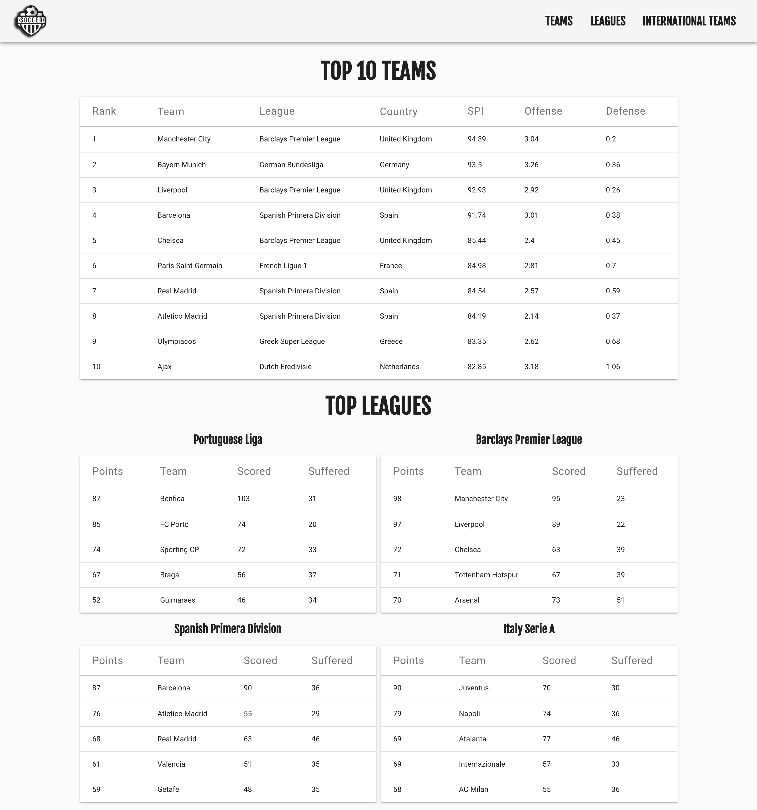
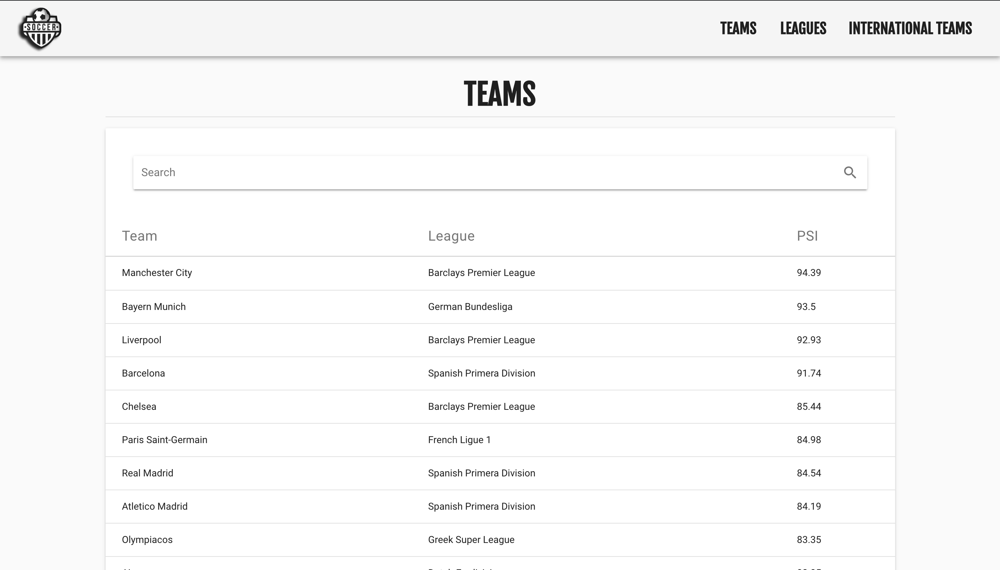
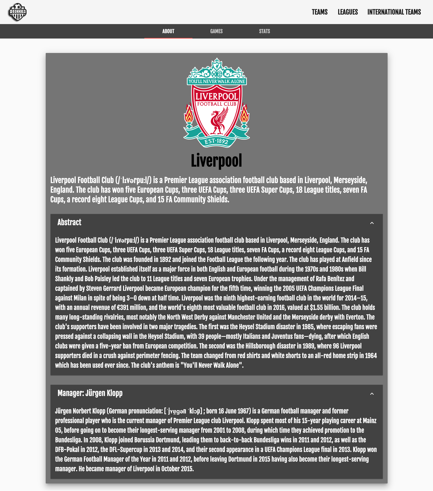
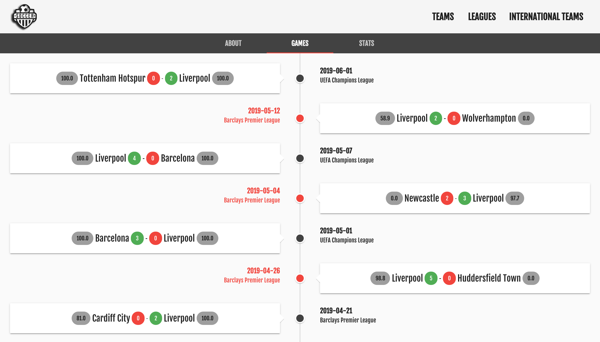
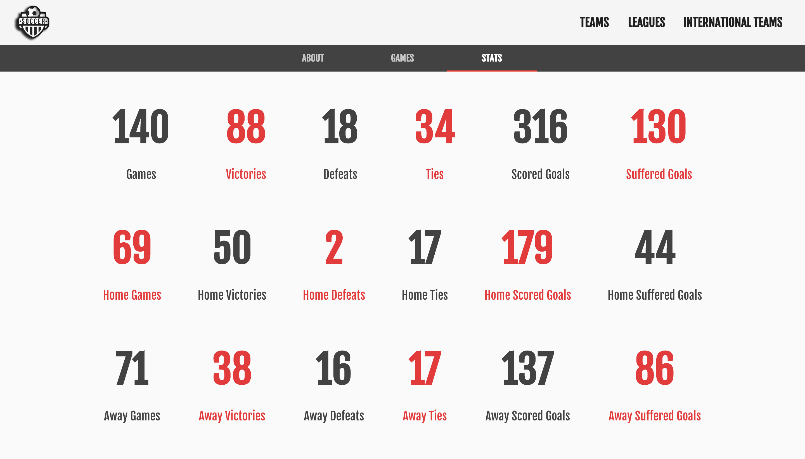
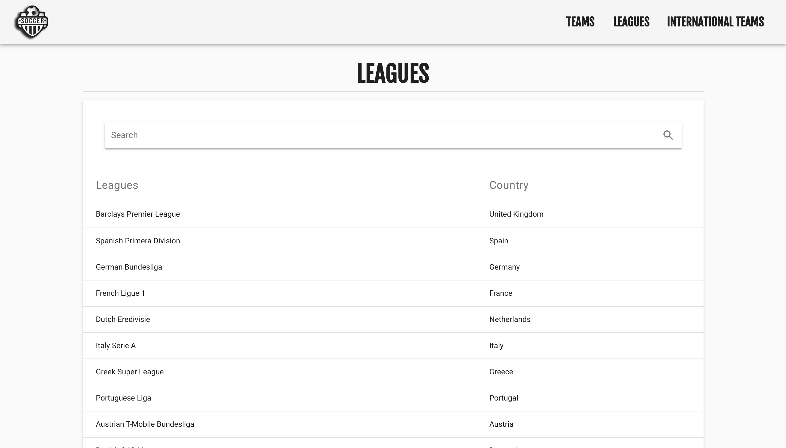
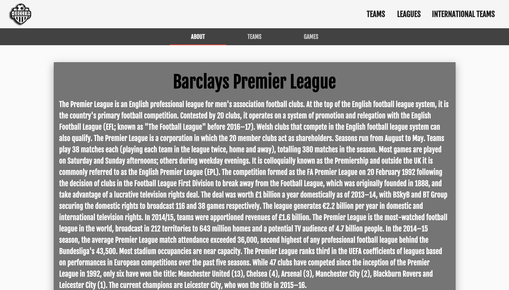
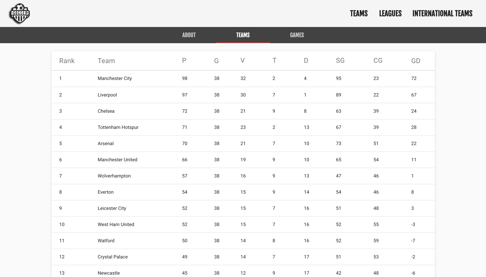
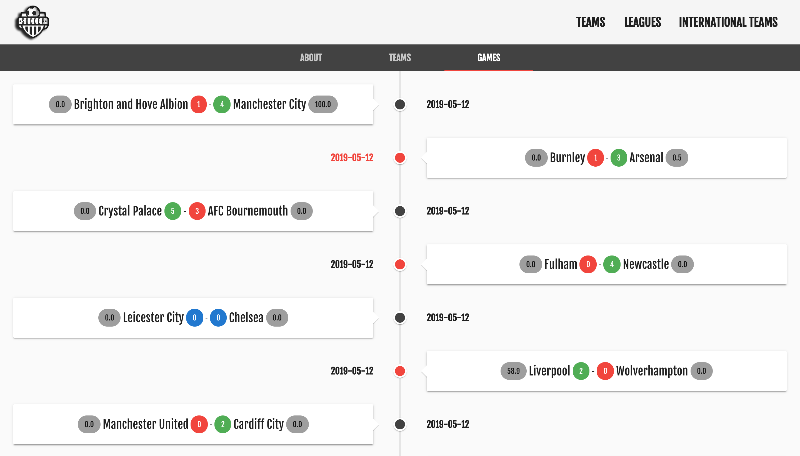
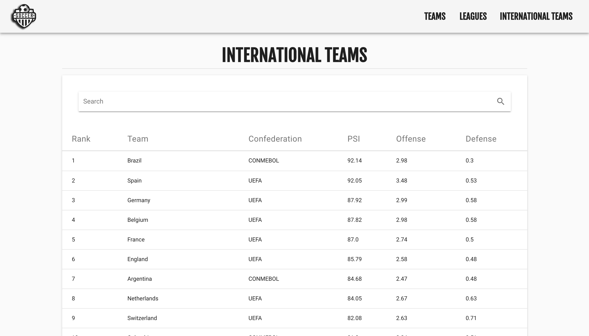

# SOCCER INFO - SEASON 18/19

Web application for displaying content using linked data. The application follows football as a theme, more specifically the 2018/2019 season, and uses data present in GraphDB, obtained through the development of an ontology and population with existing datasets, and present information from DBPedia. It was developed in the Course of Processing and Knowledge Representation of the Master of Language and Knowledge Processing.

* Express
* Vue.js
* GraphDB
* SPARQL

## Folder Structure

Structured in 3 main folders:

* datasets
    * csv: contains csv files that contain soccer data
    * ontology: contains the turtle file with the final ontology
    * results: contains the results of the scripts executed over the csv files
    * scripts: contains the Python scripts to turn the data in the csv files into turtle
* soccer: frontend of the application
* soccerREST: backend of the application

## Backend

The server is fetching data from GraphDB (listening on port 7200 in localhost) and DBPedia and responding to port 8090.

## Frontend

Is fetching data from port 8090 in localhost, and responding to port 8080.

## Usage

Make sure you have GraphDB running and the ontology imported in a repository named 'tp'.

On both soccer and soccerREST make:

```bash
npm install
```

On soccerREST make:

```bash
npm start
```

On soccer make:

```bash
npm run serve
```

The application is now available in <http://localhost:8080>.

### Frontend

Initial page:

<p align="center">
    
</p>

Teams page:

<p align="center">
    
</p>

Team page (Liverpool):

<p align="center">
    
</p>

<p align="center">
    
</p>

<p align="center">
    
</p>

Leagues page:

<p align="center">
    
</p>

League page (Barclays Premier League):

<p align="center">
    
</p>

<p align="center">
    
</p>

<p align="center">
    
</p>

International Teams page:

<p align="center">
    
</p>
